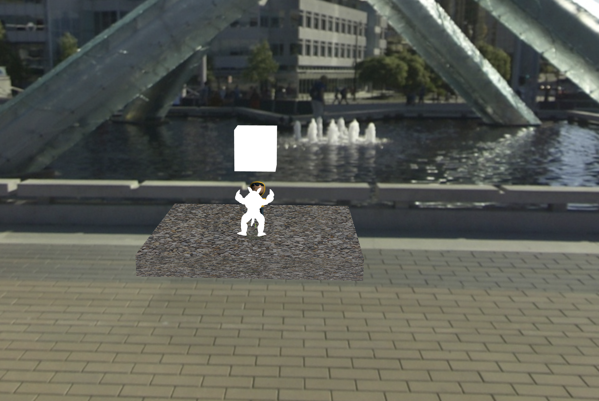
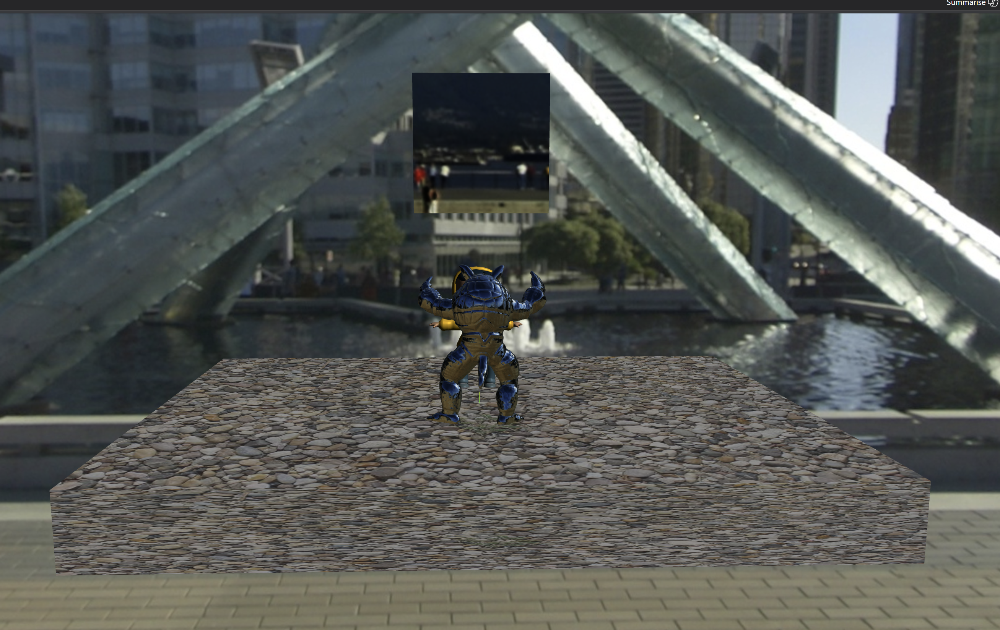
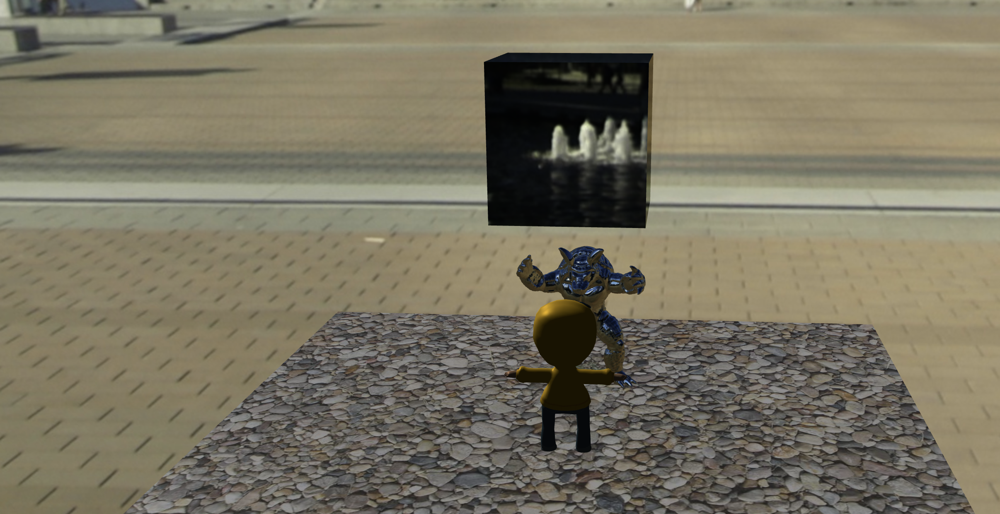
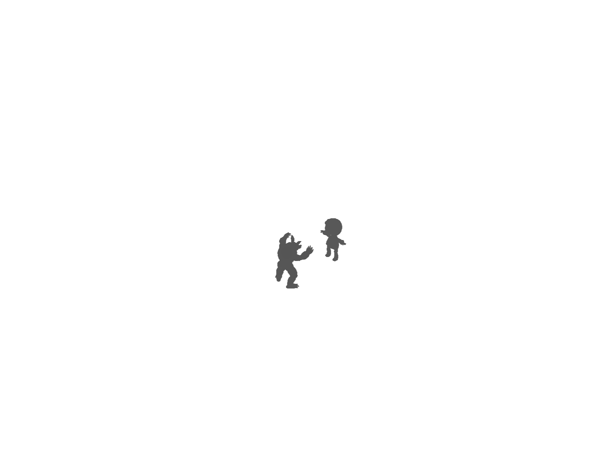
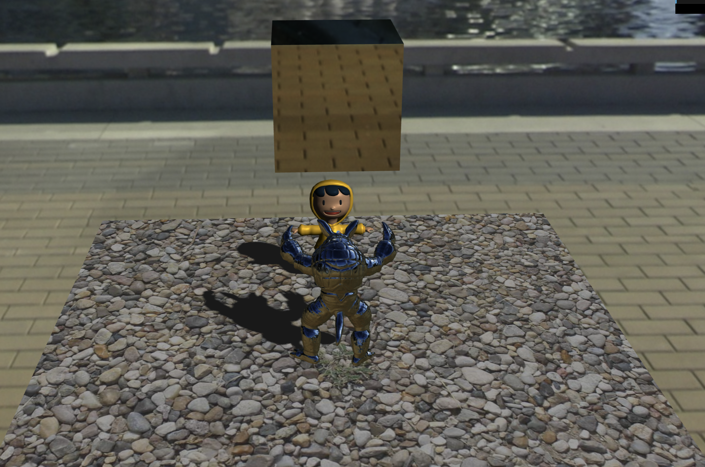
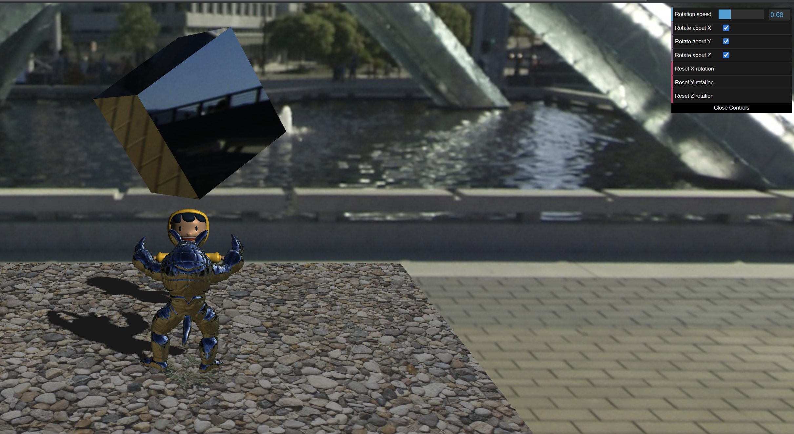

# Textures and Shadows

## Part 1 (a) — Texture mapping (`ShaderMaterial`)

### What this part does

Part (a) replaces a flat-lit or untextured look on **Shay D. Pixel** with **image-based surface color**: each pixel’s RGB comes from a **2D texture** sampled using the mesh’s **UV coordinates**, then multiplied by the shader’s existing **Blinn–Phong-style** lighting (ambient, diffuse, specular). The GPU still rasterizes the same triangle mesh; only the **fragment stage** changes how color is chosen—by **texture lookup** instead of a single constant.

### Assets

| Role | Path |
|------|------|
| Character mesh (UVs included) | `part1/gltf/pixel_v4.glb` |
| Base color / albedo | `part1/images/Pixel_Model_BaseColor.jpg` |
| Normal map (shared UVs with color) | `part1/images/Pixel_Model_Normal.jpg` |

The GLB already stores **per-vertex UVs**. Three.js exposes them to custom shaders as the vertex attribute **`uv`**.

### Application setup — `part1/A4.js`

1. **Load textures** with `THREE.TextureLoader()` (e.g. `minFilter`, `anisotropy` set for reasonable quality).
2. Create a **`THREE.ShaderMaterial`** for the character (`shayDMaterial`).
3. **`uniforms`** must include at least:
   - **`colorMap`**: `{ type: "t", value: <Texture> }` so the fragment shader can declare `uniform sampler2D colorMap` and call `texture()`.
   - **`normalMap`**: same pattern if the starter shader samples normals (keeps UV conventions aligned with the color map).
   - Blinn–Phong **`lightColor`**, **`ambientColor`**, **`kAmbient` / `kDiffuse` / `kSpecular`**, **`shininess`**, **`cameraPos`**, **`lightPosition`**, **`lightDirection`** (same idea as the floor material).
   - **`lightProjMatrix`** and **`lightViewMatrix`**: required by the vertex shader to build **`lightSpacePos`** for later shadow work; the matrices reference the same `shadowCam` object used elsewhere so they stay updated with the light camera.

After loading GLSL sources with `ShaderMaterial`, assign **`vertexShader`** / **`fragmentShader`** and apply the material to each mesh in the character scene (e.g. `traverse` + `child.material = shayDMaterial`).

### Vertex shader — `part1/glsl/shay.vs.glsl`

- **`texCoord = uv`** — Copies each vertex’s texture coordinates into an **`out vec2 texCoord`**, which is **interpolated** across triangles and becomes **`in vec2 texCoord`** in the fragment shader. This is how 2D texture space is attached to 3D geometry.
- **`vcsNormal`**, **`vcsPosition`** — Transformed into **view space** for lighting (`normalMatrix`, `modelViewMatrix`).
- **`lightSpacePos`** — `lightProjMatrix * lightViewMatrix * modelMatrix * vec4(position, 1.0)` maps the vertex into **clip space of the light camera**, used in later parts for shadows; for (a) the important piece is still correct **UV → fragment `texCoord`**.

### Fragment shader — `part1/glsl/shay.fs.glsl`

1. **Normalize v-coordinate (vertical flip)**  
   `vec2 uv = vec2(texCoord.x, 1.0 - texCoord.y);`  
   The base-color image’s rows are authored in an order that does not match how this mesh + sampler expect **\(v\)**. Flipping replaces \(v\) with \(1 - v\) on the \([0,1]\) segment, mirroring sampling **vertically** so features (eyes, logo, seams) align with the geometry. Use the **same `uv`** for **`colorMap`** and **`normalMap`** so color and normals stay in register.

2. **Sample albedo**  
   `vec3 albedo = texture(colorMap, uv).rgb;`  
   `texture()` returns a **`vec4`** (RGBA); **`.rgb`** drops alpha for opaque shading.

3. **Lighting (already in the starter)**  
   - `light_AMB` — ambient term.  
   - `light_DFF` — diffuse with `max(0, dot(N, L))`.  
   - `light_SPC` — Blinn-style specular with `pow(max(0, dot(H, N)), shininess)`.

4. **Combine**  
   `TOTAL = albedo * (light_AMB + light_DFF + light_SPC);`  
   Per-channel multiply: the texture supplies **surface pigment** (albedo); the sum supplies **how bright** each channel would be on a white surface—standard modulate step for textured Phong-style shading in a classroom pipeline.

**Note:** The normal map is sampled and unpacked with `* 2.0 - 1.0` to map stored **[0,1]** channels to **[-1,1]** tangent-space directions; the starter’s lighting still uses **`N`** from geometry in some paths—full tangent-space lighting is outside the minimal “texture the albedo” goal of (a).

### Screenshot

---

## Part 1 (b) — Cube skybox (`scene.background`)

### What this part does

Part (b) replaces the flat clear color with a **cube environment map**: six square images are loaded as one **`CubeTexture`** and assigned to **`scene.background`**. Three.js draws this as an infinite surrounding environment from the main camera’s viewpoint, so orbiting the scene feels like standing inside a textured room/skydome built from the six faces.

### Assets

Six JPEGs live under **`part1/images/envmap/`** (e.g. `posx.jpg`, `negx.jpg`, `posy.jpg`, `negy.jpg`, `posz.jpg`, `negz.jpg`). They should form a consistent panoramic set (same exposure / horizon).

### Implementation — `part1/A4.js`

1. **`THREE.CubeTextureLoader()`** — `load()` takes an array of **six URLs** in **fixed order**: **+X, −X, +Y, −Y, +Z, −Z** (same convention as the [Three.js skybox / `CubeTextureLoader`](https://threejs.org/docs/#api/en/loaders/CubeTextureLoader) docs). Wrong order produces seams or mismatched faces.
2. **`scene.background = skyboxCubemap`** — stores the result in the variable **`skyboxCubemap`** and attaches it to the main **`scene`** from `createScene(...)`. No extra CSS background is required; the WebGL pass clears/fills using the scene background when present.

The loader in this project’s Three.js build sets an appropriate **color space** on the cube texture for color data.

### Screenshot

---

## Part 1 (c) — Environment mapping (`samplerCube`)

### What this part does

Part (c) is **not** another background pass. It uses the **same** (or compatible) **cube texture** as in (b), but bound to a **`samplerCube`** and sampled **per pixel** on meshes so they look **mirror-like**: the color comes from `texture(skyboxCubemap, direction)` where **`direction`** is a **reflection vector** derived from the **world-space normal** and the **view direction**. The skybox in (b) fills empty pixels behind geometry; **environment mapping** paints that environment **onto** reflective objects (here, the **armadillo** and the floating **debug cube**).

### Files

| Piece | Path |
|--------|------|
| Vertex stage | `part1/glsl/envmap.vs.glsl` |
| Fragment stage | `part1/glsl/envmap.fs.glsl` |
| Material + uniform | `part1/A4.js` (`envmapMaterial`, `skyboxCubeMapUniform`) |

### Vertex shader — `envmap.vs.glsl`

Outputs **world-space** quantities for correct alignment with `scene.background`:

- **`worldPosition`** — `(modelMatrix * vec4(position, 1.0)).xyz`
- **`worldNormal`** — `mat3(modelMatrix) * normal` (then `normalize` in the fragment shader; uniform scale keeps this simple for the provided assets)

View-space **`vcsNormal`** / **`vcsPosition`** remain available if you extend the material later.

### Fragment shader — `envmap.fs.glsl`

1. **Unit normal** `N = normalize(worldNormal)`.
2. **Incident** vector (camera → surface): `I = normalize(worldPosition - cameraPosition)` (`cameraPosition` is supplied by Three.js in world space).
3. **Reflection**: `R = reflect(I, N)`.
4. **Sample the cubemap**: `texture(skyboxCubemap, R_adjusted).rgb`.

The [Three.js `CubeTextureLoader` documentation](https://threejs.org/docs/#api/en/loaders/CubeTextureLoader) notes a **handedness** mismatch: cube layouts follow a convention where **+X** is defined while looking up **+Z**, i.e. a **left-handed** cubemap frame, while the engine scene is **right-handed**. In practice you often **negate or swap components** of **`R`** before sampling (e.g. adjust **X**) so reflections line up with the background. If a face looks wrong when orbiting **above/below** or **left/right**, tweak that mapping until the reflection tracks the skybox coherently.

### JavaScript wiring

- **`const skyboxCubeMapUniform = { type: "t", value: skyboxCubemap };`** — tells `ShaderMaterial` to bind the loaded **`CubeTexture`** like a **`samplerCube`**.
- **`envmapMaterial.uniforms.skyboxCubemap`** references that object so the GLSL name **`skyboxCubemap`** matches.

### How to check it

Orbit the camera **around** the armadillo and the cube, and briefly look from **above** and **below**; the reflected features should **move** with the view like a real chrome surface. Compare with the yellow character, which still uses a **non–env-map** shader and stays largely diffuse.

### Screenshots

---

## Part 1 (d) — Shadow Mapping (PCF smoothing)

### What this part does
This part implements **shadow mapping** so that the **armadillo** and **Shay D. Pixel** can cast shadows onto the **floor**.

The pipeline is:
1. Render a **shadow map** (a depth texture) from the **light camera** viewpoint.
2. For each floor fragment, project it into **light space**, look up the corresponding depth in the shadow map, and decide whether the fragment is **occluded** (in shadow).
3. Smooth the hard shadow edges using **PCF (percentage closer filtering)** by averaging the shadow test over a small neighborhood of texels.

### Key bindings (scene switching)
Press:
- `1`: render the scene from the **light camera** (debug light view)
- `2`: visualize the **depth map / shadow map** (debug)
- `3`: render the **final shadowed scene** (floor uses PCF)

### Rendering flow / passes (`part1/A4.js`)
The implementation uses two relevant multipass modes:

#### Scene 2 — visualize depth map
1. **Pass 1**: render `shadowScene` with `shadowCam` into a `WebGLRenderTarget` (`renderTarget`).
2. Feed `renderTarget.depthTexture` into `postMaterial.uniforms.tDepth`.
3. **Pass 2**: draw `postQuad` in `postScene`, where `render.fs.glsl` displays the depth texture as a grayscale image.

This corresponds to the depth-map screenshot shown in `images/docs/part1d_s2.png`.

#### Scene 3 — shadowed render (PCF)
1. **Pass 1**: render `shadowScene` with `shadowCam` into `renderTarget.depthTexture`.
2. Bind:
   - `floorMaterial.uniforms.shadowMap = renderTarget.depthTexture`
   - `floorMaterial.uniforms.textureSize = 1.0 / renderTarget.width` (PCF texel step)
3. **Pass 2**: render the main `scene` with the main `camera`. The floor fragment shader computes the shadow test using the bound `shadowMap`.

This corresponds to the shadowed result shown in `images/docs/part1d_s3.png`.

### Files involved
| Stage | File | Role |
|---|---|---|
| Light depth pass | `part1/glsl/shadow.vs.glsl`, `part1/glsl/shadow.fs.glsl` | Used to render shadow casters into the depth texture (color output is irrelevant). |
| Floor shadow test | `part1/glsl/floor.vs.glsl`, `part1/glsl/floor.fs.glsl` | Projects floor fragments into light space and performs depth comparison + PCF smoothing. |
| Depth visualization (debug) | `part1/glsl/render.vs.glsl`, `part1/glsl/render.fs.glsl` | Samples `tDepth` and renders it as grayscale for scene 2. |
| Multipass orchestration | `part1/A4.js` | Creates/uses `renderTarget`, runs render passes for scene 2/3, and binds uniforms to shaders. |

### PCF logic (inside `floor.fs.glsl`)
For each fragment:
1. Project `lightSpaceCoords` into shadow-map UVs:
   - `projCoords = lightSpaceCoords.xyz / lightSpaceCoords.w`
   - `projCoords = projCoords * 0.5 + 0.5`  (map to `[0,1]`)
2. Run `inShadow()` by comparing:
   - `closestDepth = texture(shadowMap, uv).r`
   - if `closestDepth < fragDepth - bias` then occluded
3. Apply **3x3 PCF**:
   - sample 9 neighboring texels around the projected UV
   - average the occlusion results to get a smooth `shadowOcclusion` in `[0,1]`
4. Combine with lighting:
   - `shadowOcclusion = 1` means fully shadowed -> only ambient
   - otherwise visibility scales `(diffuse + specular)` by `(1.0 - shadowOcclusion)`

### Screenshots
Depth map visualization (scene 2):

Final shadowed scene with PCF (scene 3):

---

## Part 2 — Integrated demo (`part2/`)

### What this part does

Part 2 is the **self-contained** version of Assignment 4 under **`part2/`**: same ideas as Part 1 **(a–d)**—**textured character** (Blinn–Phong + maps), **cube skybox** on `scene.background`, **environment mapping** on the armadillo and the floating **debug cube**, and **shadow mapping with PCF** on the floor—plus a separate **IBL (image-based lighting)** view for the **Damaged Helmet** glTF when you switch modes. Run it from **`part2/A4.html`** (all asset paths are relative to that folder).

### Layout vs Part 1

| Area | Path under repo |
|------|-------------------|
| Entry | `part2/A4.html` → `part2/A4.js` |
| Shaders | `part2/glsl/*.glsl` |
| Shay D., floor images | `part2/images/` |
| Cubemap faces | `part2/images/envmap/` |
| Armadillo | `part2/gltf/armadillo.obj` |
| Helmet (IBL scene) | `part2/gltf/DamagedHelmet/` |

### Keyboard modes

Same as Part 1 **(d)**:

- **`1`** — light-camera debug view  
- **`2`** — depth / shadow-map visualization  
- **`3`** — final scene (shadowed floor + env-mapped objects + textured character)  
- **`4`** — IBL helmet scene (`MeshStandardMaterial`, HDR / tone mapping via `dat.GUI` when wired)

### Env-map debug cube controls (`dat.GUI`)

A **top-right** panel drives the large **reflective cube** so you can see the cubemap **change on the surface** as it spins about its center:

- **Rotation speed (rad/s)** — slider; `0` stops rotation.  
- **Rotate about X / Y / Z** — enable or disable incremental rotation per axis.  
- **Reset X / Y / Z rotation** — buttons that zero **only** that axis’s `rotation` component (others unchanged).

The **IBL** controls (exposure, tone mapping) use a **top-left** panel so the two panels do not overlap.

### Screenshot

