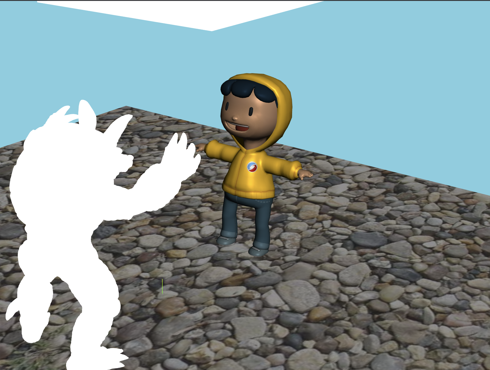

# Textures and Shadows

## Part 1 (a) — Texture mapping (`ShaderMaterial`)

### What this part does

Part (a) replaces a flat-lit or untextured look on **Shay D. Pixel** with **image-based surface color**: each pixel’s RGB comes from a **2D texture** sampled using the mesh’s **UV coordinates**, then multiplied by the shader’s existing **Blinn–Phong-style** lighting (ambient, diffuse, specular). The GPU still rasterizes the same triangle mesh; only the **fragment stage** changes how color is chosen—by **texture lookup** instead of a single constant.

### Assets

| Role | Path |
|------|------|
| Character mesh (UVs included) | `part1/gltf/pixel_v4.glb` |
| Base color / albedo | `part1/images/Pixel_Model_BaseColor.jpg` |
| Normal map (shared UVs with color) | `part1/images/Pixel_Model_Normal.jpg` |

The GLB already stores **per-vertex UVs**. Three.js exposes them to custom shaders as the vertex attribute **`uv`**.

### Application setup — `part1/A4.js`

1. **Load textures** with `THREE.TextureLoader()` (e.g. `minFilter`, `anisotropy` set for reasonable quality).
2. Create a **`THREE.ShaderMaterial`** for the character (`shayDMaterial`).
3. **`uniforms`** must include at least:
   - **`colorMap`**: `{ type: "t", value: <Texture> }` so the fragment shader can declare `uniform sampler2D colorMap` and call `texture()`.
   - **`normalMap`**: same pattern if the starter shader samples normals (keeps UV conventions aligned with the color map).
   - Blinn–Phong **`lightColor`**, **`ambientColor`**, **`kAmbient` / `kDiffuse` / `kSpecular`**, **`shininess`**, **`cameraPos`**, **`lightPosition`**, **`lightDirection`** (same idea as the floor material).
   - **`lightProjMatrix`** and **`lightViewMatrix`**: required by the vertex shader to build **`lightSpacePos`** for later shadow work; the matrices reference the same `shadowCam` object used elsewhere so they stay updated with the light camera.

After loading GLSL sources with `ShaderMaterial`, assign **`vertexShader`** / **`fragmentShader`** and apply the material to each mesh in the character scene (e.g. `traverse` + `child.material = shayDMaterial`).

### Vertex shader — `part1/glsl/shay.vs.glsl`

- **`texCoord = uv`** — Copies each vertex’s texture coordinates into an **`out vec2 texCoord`**, which is **interpolated** across triangles and becomes **`in vec2 texCoord`** in the fragment shader. This is how 2D texture space is attached to 3D geometry.
- **`vcsNormal`**, **`vcsPosition`** — Transformed into **view space** for lighting (`normalMatrix`, `modelViewMatrix`).
- **`lightSpacePos`** — `lightProjMatrix * lightViewMatrix * modelMatrix * vec4(position, 1.0)` maps the vertex into **clip space of the light camera**, used in later parts for shadows; for (a) the important piece is still correct **UV → fragment `texCoord`**.

### Fragment shader — `part1/glsl/shay.fs.glsl`

1. **Normalize v-coordinate (vertical flip)**  
   `vec2 uv = vec2(texCoord.x, 1.0 - texCoord.y);`  
   The base-color image’s rows are authored in an order that does not match how this mesh + sampler expect **\(v\)**. Flipping replaces \(v\) with \(1 - v\) on the \([0,1]\) segment, mirroring sampling **vertically** so features (eyes, logo, seams) align with the geometry. Use the **same `uv`** for **`colorMap`** and **`normalMap`** so color and normals stay in register.

2. **Sample albedo**  
   `vec3 albedo = texture(colorMap, uv).rgb;`  
   `texture()` returns a **`vec4`** (RGBA); **`.rgb`** drops alpha for opaque shading.

3. **Lighting (already in the starter)**  
   - `light_AMB` — ambient term.  
   - `light_DFF` — diffuse with `max(0, dot(N, L))`.  
   - `light_SPC` — Blinn-style specular with `pow(max(0, dot(H, N)), shininess)`.

4. **Combine**  
   `TOTAL = albedo * (light_AMB + light_DFF + light_SPC);`  
   Per-channel multiply: the texture supplies **surface pigment** (albedo); the sum supplies **how bright** each channel would be on a white surface—standard modulate step for textured Phong-style shading in a classroom pipeline.

**Note:** The normal map is sampled and unpacked with `* 2.0 - 1.0` to map stored **[0,1]** channels to **[-1,1]** tangent-space directions; the starter’s lighting still uses **`N`** from geometry in some paths—full tangent-space lighting is outside the minimal “texture the albedo” goal of (a).

### Screenshot

---

Parts **1 (b)**, **(c)**, and **(d)** will be documented here later.
